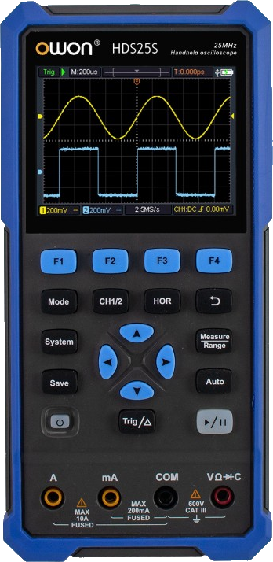
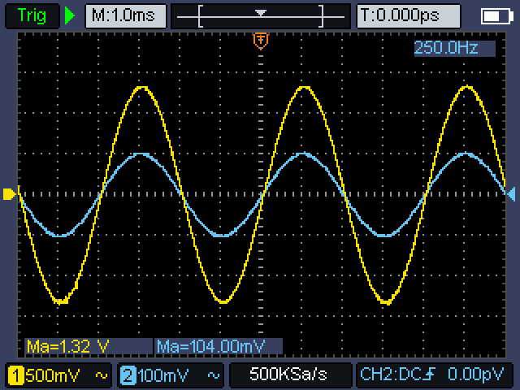
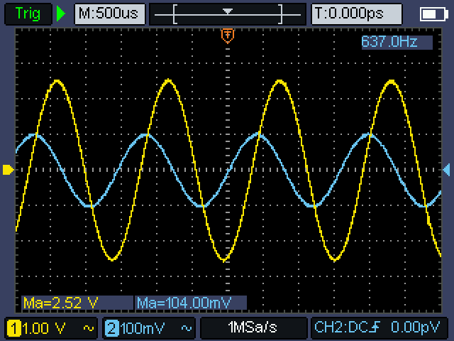
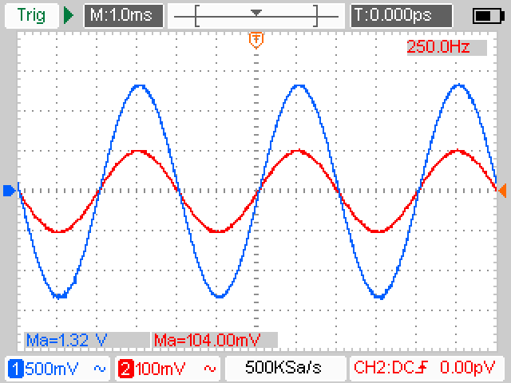

%%
title: "Another ImageMagick Use Case: Process Oscilloscope Screenshots"
date: "28-Aug-2026"
%%

# Another ImageMagick Use Case: Process Oscilloscope Screenshots

It's been a while since the last post (time flies, right?), a lot has happened
but recently I bought a portable oscilloscope, the OWON HDS25S (2CH, 25 MHz, 250
MSa/s, 8 kSa memory depth), maybe I will talk about it in a future post, but in
this one I want to talk about another use case I found for ImageMagick: process
oscilloscope screenshots to change the dark color scheme to a lighter one,
making it suitable for reports and if desired, for printing.

<div class="centered-img">
    
</div>

Of course, ImageMagick has an infinite number of uses: converting images from
one format to another, compressing images, applying filters, etc. But with these
posts, I focus on those uses that are more complex or specific to a particular
use case.

So, even though I recently bought the oscilloscope, I've already used it
extensively for assignments and lab reports. In particular, I found the
oscilloscope's screenshot feature very useful for reports. I also like that two
screenshots fit nicely side by side on a PDF page because of the screen's 4:3
aspect ratio.

<div class="side-by-side">
  
  
</div>

As seen in the pictures above, the screenshots are clear and look nice, but when
using them in reports, for my personal taste, they look better with a lighter
color scheme. This also makes sense if the report needs to be printed, as it
uses much less ink since there is no need to print the background.

To convert the screenshots from a dark to a light color scheme, I created a
shell script that applies a series of ImageMagick filters to the input file.
Part of the resulting shell script can be seen below.

```shell
WIDTH=$(magick "$INPUT" -format '%w' info:)
HEIGHT=$(magick "$INPUT" -format '%h' info:)
TRIG_X=$((WIDTH * 975 / 1000))

magick "$INPUT" -negate -colorspace Gray \
    +sigmoidal-contrast 8x65%            \
    -level 20%,90% gray.png

magick "$INPUT" -alpha off -fuzz 5%     \
    -fill transparent +opaque '#F81C00' \
    -fill '#ED0000' -opaque '#F81C00'   \
    red_mask.png

magick "$INPUT" -alpha off -fuzz 5%     \
    -fill transparent +opaque '#00FC00' \
    -fill '#007A3D' -opaque '#00FC00'   \
    green_mask.png

magick "$INPUT" -alpha off -fuzz 5%                   \
    -fill transparent +opaque '#68C4F0'               \
    -fill '#FC0000' -opaque '#68C4F0'                 \
    -region "$((WIDTH-TRIG_X))x${HEIGHT}+${TRIG_X}+0" \
    -fill "#FF6900" -opaque '#FC0000'                 \
    +region blue_mask.png

magick "$INPUT" -alpha off -fuzz 5%                   \
    -fill transparent +opaque '#F8E400'               \
    -fill '#005FFF' -opaque '#F8E400'                 \
    -region "$((WIDTH-TRIG_X))x${HEIGHT}+${TRIG_X}+0" \
    -fill "#FF6900" -opaque '#005FFF'                 \
    +region yellow_mask.png

magick "$INPUT" -alpha off -fuzz 5%     \
    -fill transparent +opaque '#F87C20' \
    -fill "#FF6900" -opaque '#F87C20'   \
    orange_mask.png

magick "$INPUT" -alpha off -fuzz 5%     \
    -fill transparent +opaque '#10F8F0' \
    -fill '#FF00FF' -opaque '#10F8F0'   \
    cyan_mask.png

magick gray.png     -colorspace sRGB         \
    red_mask.png    -compose Over -composite \
    blue_mask.png   -compose Over -composite \
    yellow_mask.png -compose Over -composite \
    green_mask.png  -compose Over -composite \
    orange_mask.png -compose Over -composite \
    cyan_mask.png   -compose Over -composite \
    "$OUTPUT"
```

The script works, by creating a color-inverted greyscale version of the input
image and saving it as `gray.png`. Then, for the main colors used by the
interface: red, blue, green, orange, cyan and yellow, it creates a mask in which
only that particular color appears, while the rest of the colors are made
transparent. It then replaces that color with the desired new color. For
example, for channel one's yellow `#F8E400`, `yellow_mask.png` is created with
the yellow color replaced with blue `#005FFF`.

At the end, all the masks are combined on top of the previously created inverted
greyscale image, resulting in the final image shown below.

<div class="centered-img">
    
</div>

It is true that simply inverting the image would have been enough, but I think
it was worth the effort to write the script, given that the colors can be
specified arbitrarily and the final result is better.
