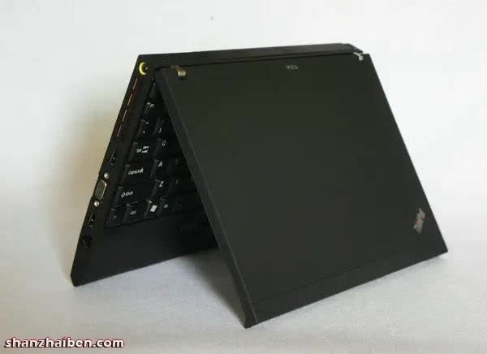
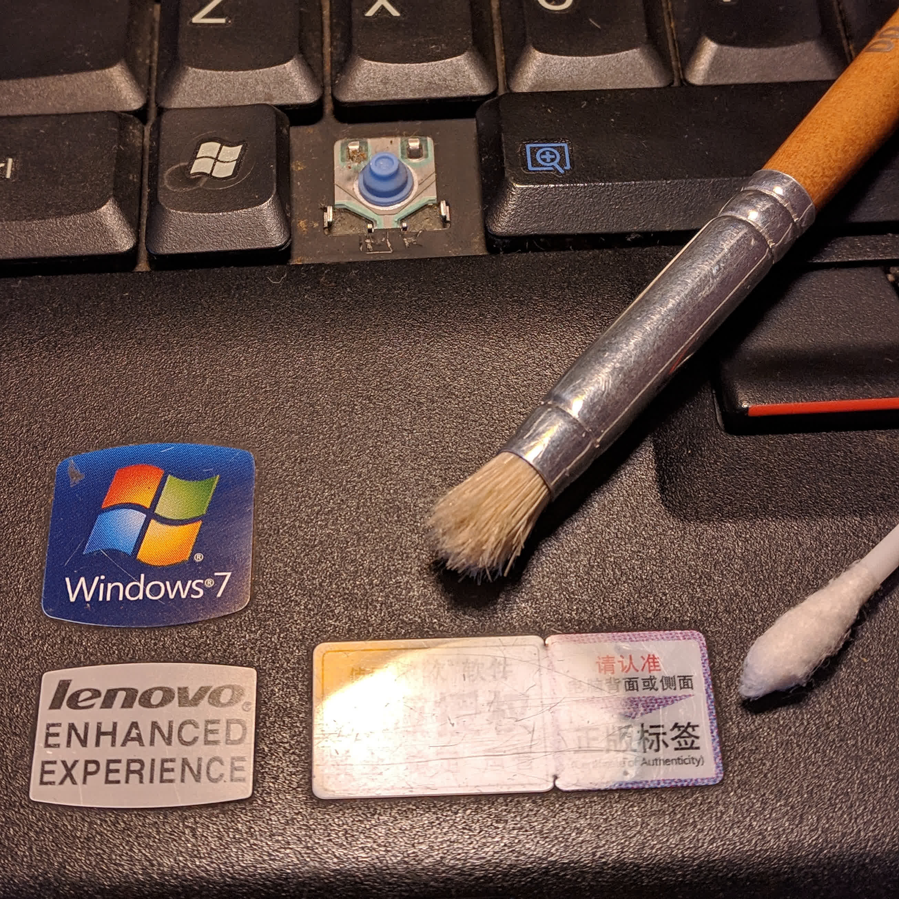

%%
title: "I bought a ThinkPad x200 for $27"
date: "26-Oct-2022"
%%

# I bought a ThinkPad x200 for $27

A few weeks ago I was scrolling through Facebook marketplace when I saw what It
looked like a ThinkPad published for exactly ARS$ 8000 (around USD $27). When I
enter the publication it was effectively a ThinkPad, precisely an x200, but it
was very dirty, this was the picture attached to the publication:  The owner stated that the machine was working but it had no
charger, that was a little bit suspicious ngl but, for the price, I couldn't be
picky, I was looking for a cheap old ThinkPad like this for a while and this was
the perfect opportunity.

So I contacted the owner, and we agree to meet the next day so I could pick it
up. Fortunately the owner was about 30 minutes in public transport from my place.

When the owner give it to me obviously it was very dirty but also I felt like
something inside was a little bit loose; the transaction was very quick, in a
corner of a known intersection so, I didn't look at it very carefully.

When I arrived home and I started to look at it with more caution, the first
thing that I noticed was that the loose part was the battery, so I didn't care
much, but, before opening the lid I noticed that the lenovo branding was missing
on the left bottom of the lid, at that moment I panicked a little because the
day before going to pick up the x200 I saw a
[post](https://www.reddit.com/r/thinkpad/comments/wmb4gl/wanna_know_something_cool_back_in_2008_a_chinese/)
which stated that cheap chinese clones of this machines where made, this cheap
clones cammed with an atom processor (trash compared to x200's processor) and
they where smaller in size, and since they were clones no lenovo brand were
present. 

This a picture of the cheap clone, it looks identical but without the lenovo
brand anywhere.

I started to look carefully at the machine again, and noticed that there was a
"Lenovo enhanced experience" sticker on the bottom, so it couldn't be a copy,
after searching for Intel Centrino on internet I found that it wasn't a
processor but a network card, which the genuine x200 came with, so it actually
was a *genuine ThinkPad*, and in fact the cheap clones where rarer than the
genuine x200 itself.

Since I hadn't the charger, I couldn't test if it worked, so I started to deep
clean it, at least all the exterior dirt, and the keyboard, which was
disgusting.

A couple of days later I picked up a used charger from a T430 (90w), and the
TrackPoint cap which was also missing. When I connected the x200 to the grid the
outer lid leds lit up, meaning the ThinkPad was receiving power and the battery
was charging (or at least trying) so I tried to turn it on, and for my surprise
the computer booted to the BIOS *without a problem*.

## Updating the BIOS
After I plugged the computer in and it booted into the bios, I checked for the
bios version and it was `3.11`. A quick check on lenovo's x200 webpage revealed
that there were BIOS updates up until version `3.16`.  I
searched on Google on how to update the bios but I couldn't find a way without
using Windows, there was [one way using
Linux](https://www.thinkwiki.org/wiki/BIOS_update_without_optical_disk) but
honestly in comparison with the Windows way was much more complicated. The most
simple way for me was installing Windows, since Lenovo provides a Windows only
BIOS updater tool. So I quickly installed Windows 7 on an 240GB Kingston SSD
which I had lying around and updated the BIOS, it was as simple as running the
BIOS updater tool, clicking update and done.

## Installing an Operating System
After adding the SSD, installing Windows 7 and updating the BIOS, I was decided
to install Linux, I wanted to try Void or Artix (w/ Runit), I had a previous
machine with Artix ([yt video showing how fast it
booted](https://www.youtube.com/watch?v=dBdNQdocrVc)) for almost a year and it
worked pretty well, I even gamed CS GO on it. So I made a Void Linux bootable
drive following the [Void Linux
docs](https://docs.voidlinux.org/installation/live-images/prep.html), but, when
I tried to boot into it, nothing. The BIOS wouldn't recognized the USB drive, I
also tried making a bootable USB with
[balenaEtcher](https://www.balena.io/etcher/) but again, nothing. The weird
thing was that if I made an arch Linux bootable USB using the previous both
methods the BIOS would boot instantly. Because it was late, I ended up
installing arch Linux. During the installation I noticed that the BIOS was not
UEFI compatible, and that was the cause of all the trouble. After I finished the
installation and configuration of arch Linux, I searched for a tool that would
allow me to make legacy BIOS compatible boot mediums, I stumbled with
[WoeUSB](https://github.com/WoeUSB), I made a Void Linux bootable USB drive with
that tool and it booted instantly, so maybe in a future I will install Void
Linux like I intended in the first place.

Anyway do you like my arch Linux rice?  I'm using Suckless's
[dwm](https://dwm.suckless.org/) and [st terminal](https://st.suckless.org/),
Firefox for the web browser and dolphin for the graphical file manager. You can
check out my [dotfiles](https://github.com/mjkloeckner/dotfiles) on GitHub,
although I didn't update them yet, but maybe at the time when you are reading
this I already did.

## Using an x200 in 2022
The computer works perfectly, the only thing missing is OpenGL version 3.X
support, because the integrated graphics card is old the last version supported
is 2.1, so I couldn't make kitty nor Alacritty terminals work. I ended up
installing Suckless's simple terminal (st), and it works like a charm, and it's
very lightweight too.

The Core 2 Duo although it has almost 15 years, it is still very usable for
surfing the web and writing code, and general daily lightweight task. I'm
planning to take the x200 to the University to write notes and check PDFs in the
library, since the x200 only weight at around 1.6kg with the 90w charger, its
more lightweight than my 2.0kg dell, it is also very small in dimension, the
x200 is like a [netbook](https://en.wikipedia.org/wiki/Netbook) with steroids.
The most impressive thing is how usable it is with only 2GB of RAM, when I saw
in the BIOS that it only had 2GB I thought that it would be unusable to be
honest, but no, by using dwm the idle ram usage is 200MB approx. and with a
couple of tabs opened in Firefox and some terminals the RAM usage sits at around
1.3GB, of course I set up a swap partition during the installation and when I
open more tabs in Firefox Htop reports some swap usage, so the swap partition
helps.

This is the x200 compiling [translate
shell](https://github.com/soimort/translate-shell) from source. 

Another picture of the x200, recording
[MIDI](https://en.wikipedia.org/wiki/MIDI?wprov=sfla1) using
[qtractor](https://qtractor.org/). I've also used the x200 for live MIDI
processing, and it worked without a problem. 

## Things to do next
There is a ton of things that I want to try with this computer, like Libreboot,
swapping motherboards, running Void Linux, etc. But first I would like to
disassemble it entirely to remove all the dust from the motherboard and replace
the thermal paste. Also buy a 9-cell battery. The one that came with the
computer only lasted around 10 minutes the first charge, after calibration I
made it last an hour and a half. I saw a used 9-cell genuine lenovo near my
place on MercadoLibre for the same price that I bought the x200 lol (around USD
$27). So stay tuned to the blog post to read all the updates on the x200.
