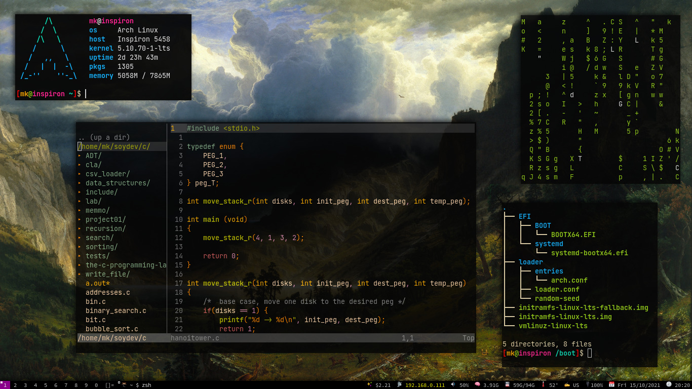
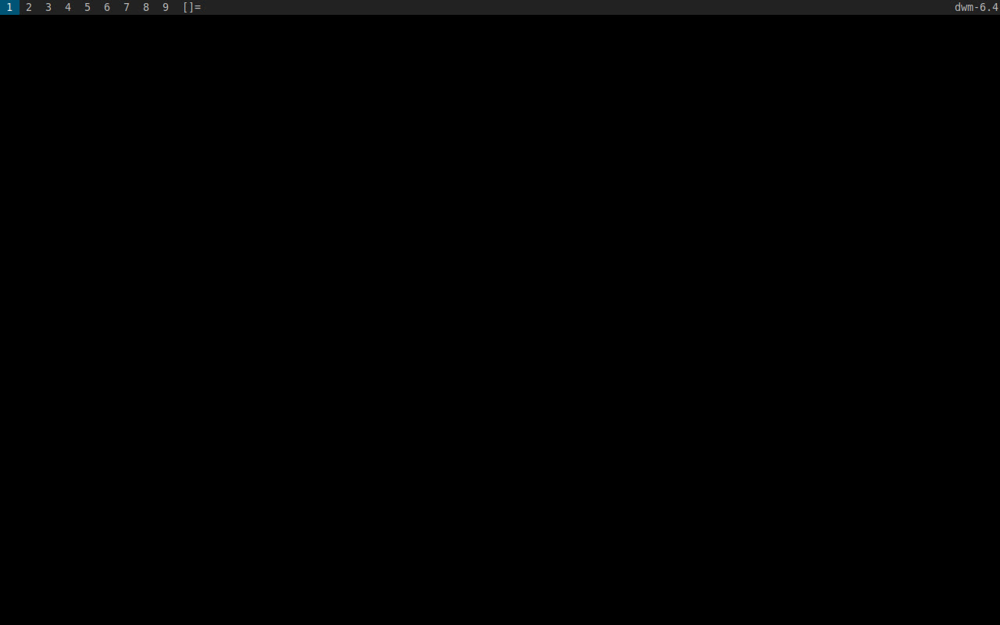
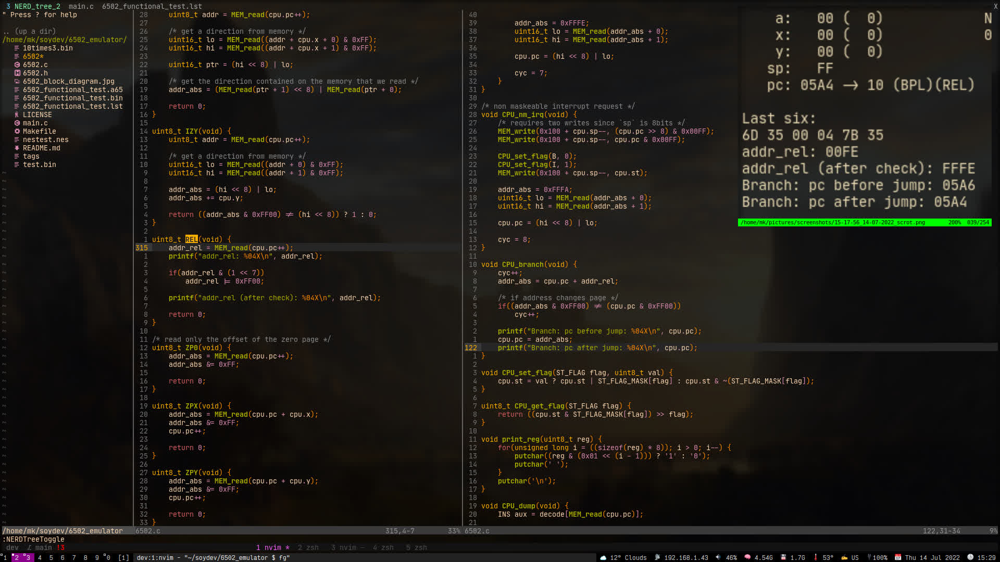
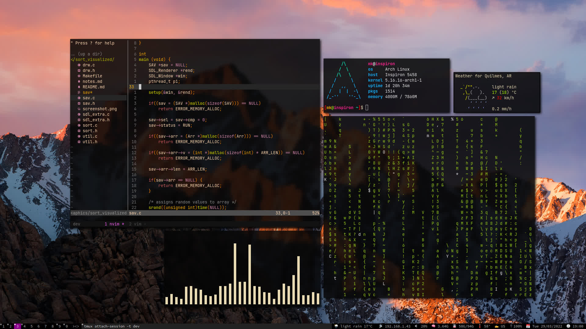

%%
title: "dwm: The dynamic window manager"
date: "23-Oct-2021"
%%

# dwm: The dynamic window manager

A window manager is a software that can manage the layout and appearance
of every window spawned in your desktop, most people confuse them with
desktop enviroments, which aren't the same since a desktop enviroment is
more like an ecosystem, they come with a more 'complete' set of tools,
like a basic web browser, a terminal emulator or a graphical calculator, an example
of desktop enviroment would be gnome, xfce or kde plasma; instead a
window manager is only the program that manages the windows spawned,
although there are window managers that come with a little more, like
docks or taskbars (openbox for example).

In my case I use dwm, which is a window manager written in C developed
by suckless software. The most relevant thing of this window manager is
that out of the box it comes with the most basic functionallity, and if
you want to extend it you need to patch it (I explain patching later).

By default dwm comes with 9 workspaces, in which you can open as many
windows as you please; to spawn a new window for example a web browser
you need to assign it a keybinding or use an application launcher like
[dmenu](https://tools.suckless.org/dmenu/)

[](screenshot.png "Screenshot of my dwm build")

## Installing dwm

### Requisites

- GNU/Linux or BSD based operating system
- A C library and a C compiler
- make utility installed
- X server installed
- dwm source code

As you can see above you can only install dwm on GNU/Linux or BSD based
distros, unfortunally dwm is not available for Windows users and I'm not
sure if there is an alternative.

### Steps

In order to install dwm download the source code from [suckless.org/dwm](https://dwm.suckless.org/),
you can clone the repo from [git.suckless.org/dwm](https://git.suckless.org/dwm) or
download it as a tar file.

After you obtain the source code navigate to the root folder
of the source code and execute the following command

```console
$ sudo make install
```

after that you can log out of you user account, if you use a display
manager, select dwm as window manager on it and log back in, if you
don't use a display manager, you need to edit your .xinitrc file located
at your home folder, so that when you start Xorg dwm gets launched, you
do this by adding `exec dwm` to the end of the .xinitrc
file, its *important* that you add it to the end of the file.

```console
exec dwm
```

Then you can start the X server by executing `startx` on a tty and
dwm should start without any problems.

This is what vanilla dwm looks like:

[](vanilla.png "Vanilla dwm")

## Customizing dwm

### Setting a wallpaper

Before getting into dwm configuration, let's add a wallpaper to make things look
a little bit nicer. You can set a wallpaper from different ways, the simpler for
me is installing feh and the executing the following command

```console
$ feh --bg-fill <image>
```

you can also avoid setting --bg-fill and chossing other feh options to set the wallpaper
(read man feh).

Then add `.fehbg &` to your .xinitrc so the wallpaper gets loaded when Xorg starts, it is important
that you add it before dwm gets executed, otherwise it will never be ran

```console
$HOME/.fehbg &

exec dwm
```

A graphical way of setting a wallpaper is with nitrogen, just install nitrogen open it
with dmenu (MOD+p by default), include the folder where you have your wallpaper, select the
image you want and the apply. To make changes persistent on every startup
add this to you .xinirc file

```console
nitrogen --restore

exec dwm
```
### dwm configuration

Basically you configure dwm by editing its source code, there is a C header file, named
[config.h](https://github.com/mjkoeckner/dotfiles/blob/master/.config/dwm/config.def.h)
in the root folder of dwm, if you open it with a text editor you can see a
lot of variables, for example the line `static const int topbar = 0`
defines a variable named topbar which you can set to 1 or 0, to select
if the status bar should spawn in the top or bottom of the screen respectively.
You can also change the MOD key (by default its left alt), I like to remap
mine to left Super (windows key).

After every change you make to the source code you need to *recompile dwm*.


#### Show information on the status bar

dwm by default won't show any information on the status bar, this is
done by using the xsetroot utility, which sets the value of WM\_NAME enviroment
variable, the content of this variable is automatically displayed by dwm on the
right side of the statusbar. Lets assume you want to set the clock and date
on the status bar, well you could accomplish this by executing the following command

```console
$ xsetroot -iname $(date)
```

and all the output of the command `date` would be stored on the WM\_NAME variable
causing dwm to print the date on the statusbar, this
makes dwm status bar highly scriptable, in fact there are a ton of status
bar implementations, the one that I use is called
[dwmblocks](https://github.com/torrinfail/dwmblocks) and its also
written in C and the configuration its pretty much the same as dwm, in
order to get information you need to have scripts that prints the
desired data to stdout, then you can include them on the config.h of
dwmblocks. It is important that the scripts are on your user's PATH, otherwise
it won't work.

#### Getting emoji support on dwm

dwm by default doesn't come with emoji support, if you want to render
an emoji in the status bar, it's going to either show it as a box or in
the worst case crash.

In order to get emoji support first make sure you have installed `libxft`,
then you need to get a font with emoji support, I'm using [JoyPixels® font](https://www.joypixels.com/)
you can also use [Google's noto font](https://fonts.google.com/noto),
or any other font that comes with emoji support, then open dwm `config.def.h` and
append to the fonts array the name of the font you want to use as fallback for the first font,
since the emojis are not being printed because the font used doesn't include emojis, my
config looks like this:

```c
static const char *fonts[] = { "Source Code Pro:style=Regular:size=9",
                                "JoyPixels:style=Regular:size=8",
                                 "DejaVu Sans" };
```

I've also added `DejaVu Sans` to the fonts array because, sometimes, the emojis where being displayed
with a little box or square next to them, this was a quick solution.

After you setup the font you need to remove or comment a chunk of code
from drw.c, between lines 136-150 there is a function named `iscol`, you
need to remove it or comment it, since this causes dwm to crash.

```c
/* Do not allow using color fonts. This is a workaround for a BadLength
 * error from Xft with color glyphs. Modelled on the Xterm workaround. See
 * https://bugzilla.redhat.com/show_bug.cgi?id=1498269
 * https://lists.suckless.org/dev/1701/30932.html
 * https://bugs.debian.org/cgi-bin/bugreport.cgi?bug=916349
 * and lots more all over the internet.
 */
FcBool iscol;
if(FcPatternGetBool(xfont->pattern, FC_COLOR, 0, &iscol) == FcResultMatch && iscol) {
    XftFontClose(drw->dpy, xfont);
    return NULL;
}
```

Finally you can recompile dwm and, if everything went fine, you will get emoji support.

#### Patching dwm

Since dwm is a simple program than doesn't include much features, if
you want to extend it, for example by adding a
[systray](https://dwm.suckless.org/patches/systray/) to the status bar,
you need to patch dwm. To do this first you need to download the patch
from [suckless.org/patches](https://dwm.suckless.org/patches/), then
make sure you got it 'patch' installed, although I think it comes with
most linux distributions by default nowdays.

To apply a patch navigate to dwm's root folder and execute this command

```console
$ patch -p1 < <file.diff>
```

being `file.diff` the patch file downloaded previoulsy of course.

If you never patched dwm before then probably no errors would be
reported, but if you already have applied a ton of patches, (or sometimes just a couple)
then probably you would get a HUNK \## FAILED, in this case you need to get your hands
dirty, and manually patch all the files that failed, you do this by
opening the files with .rej extension (short for rejected), and the
corresponding file to be patched, for example dwm.c and dwm.c.rej, and
then you add all the chunks of code from the rejected file into the
corresponding place in the non rejected file, you know where you should
put the chunks of code because in the rej file you can see at the start
of every chunk there is a '@@' followed by a number of line; also
lines starting with plus means add, and minus means delete, if I'm not
clear you should google how to use diff and patch to modify a file.

## More screenshots

#### Debugging [6502 emulator](https://github.com/mjkloeckner/6502) with dwm, vim and tmux

[](debugging.png "Debugging 6502 emulator")
&nbsp;


#### Floating window manager?

[](floating.png "Floating show while raining")

## Useful links

- [What is a window manager?](https://en.wikipedia.org/wiki/Window_manager)
- Make sure to check the [suckless webiste](https://suckless.org/)
- [suckless dwm website](https://dwm.suckless.org/)
- [X server man page](https://www.x.org/releases/X11R7.7/doc/man/man1/Xserver.1.xhtml)
- [patch man page](https://man7.org/linux/man-pages/man1/patch.1.html)
