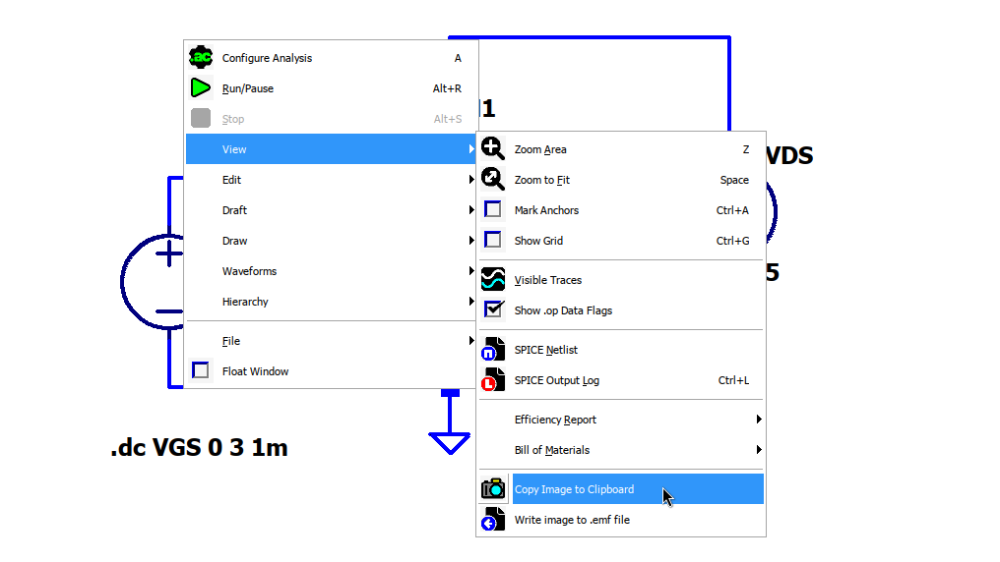
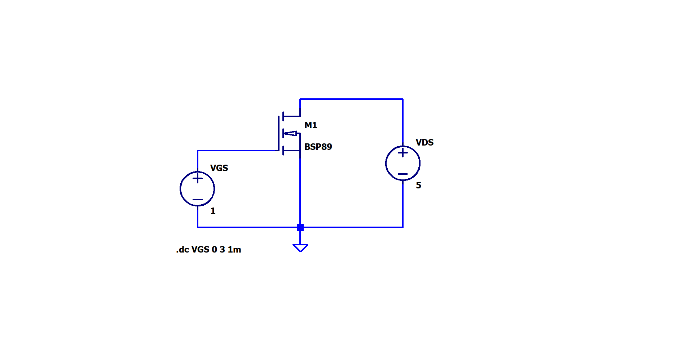
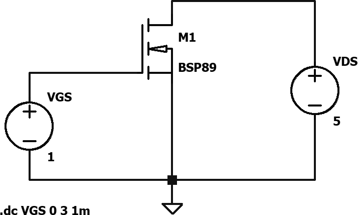

%%
title: "ImageMagick use case: export and process LTSpice schematic images"
date: "19-Nov-2024"
%%

# ImageMagick use case: export and process LTSpice schematic images

In this post I explain how I managed to simplify to a 'one-liner' the series of
steps involved in exporting and processing the image of an LTSpice schematic for
further use in a report paper or any similar document.

> ***TL;DR*** 
> 
> Copy to clipboard the current view of the schematic in LTSpice: `right click >
> view > copy image to clipboard`, then, using xclip, pipe the content of the
> clipboard to magick and save the image with name `schematic.png`, in black and
> white (`-colorspace grey`) and cropped to the contents of the image (`-trim`)
> 
> ```console
> xclip -selection clipboard -t image/bmp -o | magick - -colorspace grey -trim schematic.png
> ```
> <!--`-->

## Getting an image of the schematic from LTSpice

First we copy the current schematic view in LTSpice to the clipboard with:
`right click on an empty space of the schematic > view > copy image to
clipboard`.



Others may just take a screenshot of the schematic, this is also a valid way of
getting an image of the schematic but as we'll see later it's more practical to
just copy the image to clipboard since it doesn't require the creation of a new
temporary file.

## Previous Procedure

<!--
First we copy the current schematic view of LTSpice to clipboard with: `right
click on an empty space of the schematic > view > copy image to clipboard`.


Other may just take a screenshot of the schematic, this is also a valid way of
getting an image of the schematic but in my experience it's better, and simpler,
to copy the image to clipboard
-->

After copying the image to the clipboard from LTSpice as seen in the previous
section, just using a GUI program like gimp, paste the image from the clipboard,
crop the image, apply black and white filters, etc; finally export the image.

This procedure looks simple, but when doing it with multiple schematics it turns
tedious. In the current procedure the steps after copying the image shrinks to a
one-liner (a single line containing one or more chained commands).

## Current Procedure

<!--
Copying the schematic image from LTSpice is the same as the previous way, the
steps that change are the following ones which involve getting the image from
the clipboard, processing it and finally exporting it to a file. In this new
procedure we use a series of chained command line commands to obtain that.
-->

Instead of using a GUI program after copying the image to the clipboard from
LTSpice, we use a series of command line tools to process and save the image, in
particular, xclip to manage the clipboard contents (X session) and ImageMagick
to process the image.

### Getting the image from the clipboard

To get the image from the clipboard we use xclip (xclip works for an X session,
if you are using Wayland you may use [wl-clipboard](https://github.com/bugaevc/wl-clipboard)
which it may have similar commands to the ones seen on this post).

<!--
Then we can query the format of the copied image by specifying the `TARGETS`
target to xclip, as follows:

After copying the image from LTSpice, you may query the supoorted image formats
of that image, you can do that 
-->

After copying the image from LTSpice, you may query the supported image formats
of the clipboards contents, you can do that by providing the `TARGETS` to the
target flag `-t` as show next.

```console
$ xclip -selection clipboard -t TARGETS -o
PIXMAP
image/bmp
TARGETS
MULTIPLE
TIMESTAMP
```

Notice that we provide the `-selection clipboard` flag, this selects the
clipboard named `clipboard` (there is also `primary` and `secondary`). In this
case we use LTSpice running on wine so it may use a different clipboard for
other installations.

Specifying the `image/bmp` target to xclip and no filename to the output flag
`-o`, will result in xclip printing the binary data to standard output (this
will probably mess the terminal). By piping the binary data to a file, as shown
next, we can make sure if the data is a bitmap formatted image.

```console
$ xclip -selection clipboard -t image/bmp -o > schematic_raw
```

Executing the `file` command on the new file `schematic_raw` reveals that
effectively it is a bitmap file.

```console
$ file schematic_raw
schematic_raw: PC bitmap, Windows 3.x format, 1916 x 966 x 32, 3 compression,
image size 7403424, cbSize 7403490, bits offset 66
```

The raw schematic image, in bitmap format, looks exactly as shown in the LTSpice
schematic view.



The next step is to convert it to black and white, trim the white margins and
finally convert it to png format.

### Processing the image using ImageMagick

Instead of piping the output of the xclip command to a file, we pipe the binary
data to ImageMagick appending a single dash `-` to tell magick to read from
standard input. To apply the desired effects on the image we also append the
flag `-colorspace grey`, to make the image black and white, the flag `-trim`,
to crop the image to the content, and finally we save the resulting image in png
format by appending the extension to the output file name (for example
`schematic.png`).

```console
$ xclip -selection clipboard -t image/bmp -o | magick - -colorspace grey -trim schematic.png
```

The final image results as follows



ImageMagick can also read from a file, for example if you took a screenshot of
the schematic, you can process it by specifying the input file name, instead of
reading from standard input.

```console
$ magick schematic_screenshot.png -colorspace grey -trim schematic.png
```

<!--
Simply pipe the output of the clipboard to ImageMagick and add the flag
`-colorspace grey`, to make the image black and white, and the flag `-trim` to
crop the image to the content.

output of the magick command is the following image, which is in black and
white plus the margins are cropped, resulting in an image ready for inserting in
a paper.
-->
