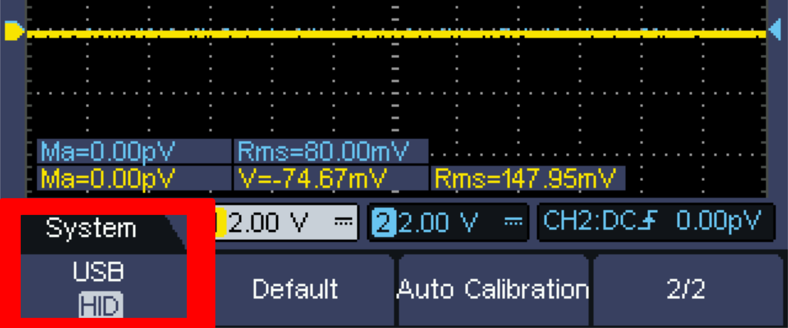
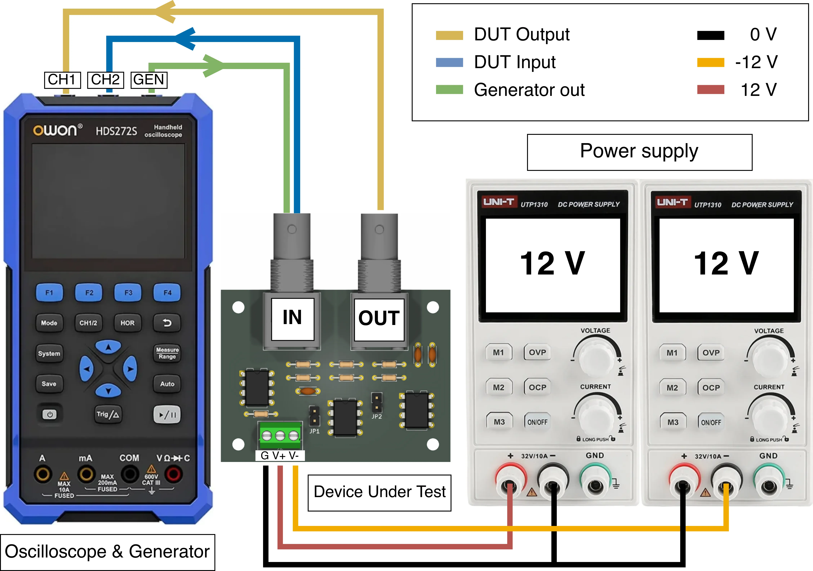
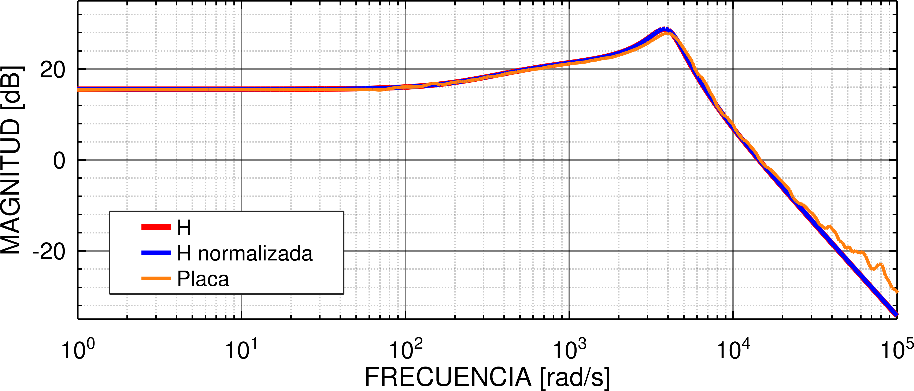

%%
title: "Owon HDS25S Bode Plot Using Python and SCPI Commands"
date: "19-Sep-2026"
%%

# Owon HDS25S Bode Plot Using Python and SCPI Commands

As you may know from my previous post, I bought the Owon HDS25S handheld
oscilloscope, and I think one of its key features is the SCPI interface, which
allows the device to be controlled over USB by sending text commands. In this
post I will show how to get a Bode plot (for now, only the magnitude of the
frequency response) using the Owon HDS25S and the built-in function generator,
varying the frequency and measuring the output value of the device under test in
a completely automated way by using a Python script that sends SCPI commands.

## SCPI Commands

SCPI stands for Standard Commands for Programmable Instruments and are used for
controlling devices, mainly electronic labs equipment, like oscilloscopes,
multimeters, bench power supplies, functions generators, etc. The control of the
device is made from a prompt or query, typically over a serial port or USB, but
modern devices also support SCPI over the network. 

SCPI commands can be send interactively, i.e. typing the commands in a serial
monitor, or in a non interactive way, i.e. through a script which sends the
commands line by line. This last method of sending the SCPI commands is where
you get the true power of the commands, because you can automate test runs,
achieving the same behaviour of the device on every run, or even the same
behaviour on multiple devices. Unfortunately, only a small set of SCPI commands
are standardized across different manufacturers. For example, `*IDN?` to query
the identification of the device. Beyond these common commands and standardized
SCPI subsystems, manufacturers often implement their own instrument-specific
commands.

## Owon HDS25S

The Owon HDS25S supports SCPI commands over the USB port, and the HDS200(S)
Series SCPI standard can be downloaded from Owon's website (also from
[https://git.kloeckner.com.ar/hds25s/](https://git.kloeckner.com.ar/hds25s/)).
To make the oscilloscope accept the SCPI commands the USB mode must be set to
HID on the oscilloscope system settings, in this way when connecting it via USB,
it reports as a serial device (on Linux based systems as `/dev/ttyUSB*`).



The cool thing about this oscilloscope is that it accepts SCPI commands for all
of it three modes: multimeter, function generator and oscilloscope, and also
that the function generator can be used at the same time as the oscilloscope.
This last thing is a key point for achieving our goal.

## Bode Plot


On a Bode plot, the magnitude and phase of the frequency response of a device is
plotted as a function of frequency, with the frequency logarithmically spaced
and the magnitude typically scaled in decibels. To achieve a bode plot, the
traditional way is to connect a frequency generator on the input of the device
under test (DUT for now on) and vary the frequency of the function generator,
measuring and writing down the amplitude of the output of the DUT for every
frequency.

Given that the HDS25S supports SCPI commands for both the function generator and
the oscilloscope, the connections for the automated and traditional methods are
the same. The difference is that, instead of varying the frequency and measuring
the output manually, SCPI commands are used. Consider the test bench shown
below.



To automate the process of varying the frequency and measuring the output, a
script is used. To obtain the magnitude data, the script must iterate over a
list of logarithmically spaced frequencies and for every frequency do the
following:

1. Set the function generator to the current frequency.
2. Measure the peak value of the output of the DUT.
3. Save the current frequency and the measured value on a list of results.

For example, consider the following pseudo-code.

```python
frequencies = [1 10 100 1e3 10e3 100e3]
magnitude = []

for frequency in frequencies:
    func_generator.set_freq(frequency)
    measured_val = scope.measure_peak_val()
    magnitude.append(measured_val)
```

## Getting the Data with PyVISA

The script used is written in Python using the
[PyVISA](https://pyvisa.readthedocs.io/en/latest/) library to send and receive
SCPI commands to and from the instrument. The PyVISA library abstracts away the
communication interface used by the instrument (RS-232, USB, Ethernet, etc.),
making it easy to establish communication with the instrument.

To use PyVISA, we need to know the device location beforehand. On Linux-based
systems, the Owon HDS25S appears as `/dev/ttyUSB*` (when USB mode is set to HID,
as mentioned). Knowing the device location, the following snippet sends the
identification query. If everything is good the console should print the device
response, for example "OWON,HDS25S,24531234,V8.8.2".

```python
import pyvisa

DEV_PATH="/dev/ttyUSB0"

rm = pyvisa.ResourceManager('@py')
dev = rm.open_resource(f"ASRL{DEV_PATH}::INSTR")
print("Identification: ", dev.query("*IDN?"), end="")
```

If the previous snippet worked it means that commands can be sent to and
received from the instrument. To configure the oscilloscope, the folloing
commands sets the channel 1 scale to 2 V per division, DC coupling and probe
attenuation to X10. 

```python
dev.write(":CH1:SCALe 2.00V")
dev.write(":CH1:COUPling DC")
dev.write(":CH1:PROBE 10X")
```

Similarly for the function generator, the following sets the output to a
sinusoidal wave with 1 V peak value and 1 kHz of frequency.

```python
dev.write(":FUNCtion:AMPLitude 1.00")
dev.write(":FUNCtion SINE")
dev.write(":FUNCtion FREQuency 1000")
```

To vary the frequency, a list of logarithmically spaced frequencies is needed to
iterate over. For this, the [NumPy](https://numpy.org/) library and its
[logspace](https://numpy.org/doc/stable/reference/generated/numpy.logspace.html#numpy-logspace)
function are used to create the `freqs` list. An empty list `amps` is also
created to append the measured amplitudes.

```python
import numpy as np

freqs = np.logspace(0, 5, num=20)
amps  = []
```

Given the list of frequencies `freqs`, the following snippet steps through every
frequency, setting the function generator to that frequency. After a small
time delay, the peak value of the channel to which the output of the DUT is
connected is measured and appended to the list of measured amplitudes `amps`.
The time delay is needed because the measurement function of the scope is not
instant after setting a new frequency.

```python
for freq in freqs:
    scope.write(f":FUNCtion:FREQuency {freq}")
    tb_str = get_best_timebase(freq)
    scope.write(f":HORizontal:SCALe {tb_str}")
    time.sleep(0.5)
    val = float(scope.query(":MEASurement:CH1:MAX?").strip())
    amps.append(val)
```

The function `get_best_timebase(freq)` returns the best horizontal scale for the
given frequency `freq`. Note that the peak value is measured using the channel 1
voltage 'max' measurement, equivalent to the voltage 'max' measurement from the
physical menu. This has the disadvantage that the waveform must fit within the
visual area to obtain the actual value. If it does not fit, the measurement
returns, for example, ">10.00", meaning that the peak value is greater than 10
volts and cannot be measured. A fix for this is to write a function similar to
`get_best_timebase`, but for the vertical channel scale, setting the best fit
for the vertical view space.

## Plotting the Data

To get a figure of the Bode plot from the data we can use a python plotting
library, for example [matplotlib](https://matplotlib.org/stable/). Another
possibility it to export the data and use another tool. I like
[Octave](https://octave.org/) which is similar to
[MATLAB](https://la.mathworks.com/products/matlab.html). To export the data as
CSV consider the following snippet.

```python
data = np.column_stack((freqs, amps))
np.savetxt("data.csv",
           data,
           delimiter=",",
           fmt=["%d", "%.2f"])
```

In Octave, plotting the data read from the CSV file is easy. In the following
snippet, after loading the data, the measured values are normalized. This is
achieved by dividing all the values by the function generator peak value (the
peak value set in the function generator). Next, the values are converted to
decibels, given that the values are voltage measurements, the conversion is done
by taking the base 10 logarithm of every value times 20. Lastly, and optional,
to smooth the curve a mean between contiguous values can be calculated using
the `movmean` function, in the following snippet the mean is taken for every 5
contiguous values.

```octave
data = csvread("data.csv");
freq = data(:, 1);
mag  = data(:, 2);

mag_db = 20 * log10(mag);
mag_db_smooth = movmean(mag_db, 5);

figure();
semilogx(freq, mag_db_smooth);
```

In a similar manner as above but tweaking the appearance of the figure, the
following bode plot is obtained. The orange trace represents the
frequency response obtained with this method. The red trace, "H", is the
frequency response of the theoretical transfer function of the DUT. The blue
trace, "H normalizada", is the frequency response of the theoretical transfer
function of the DUT but with normalized commercial component values.


