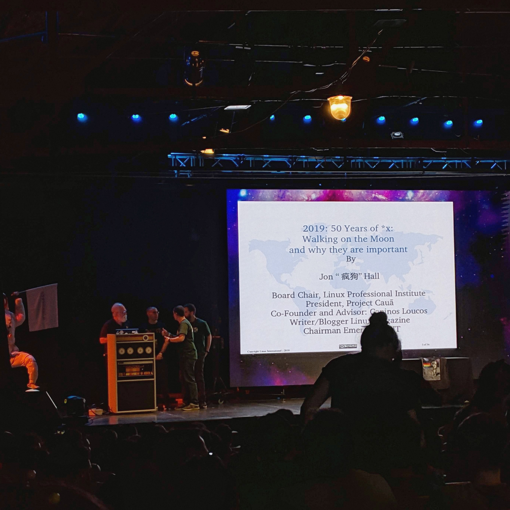

% title: "I'm going to Nerdearla 2022"
% date: "23-Sep-2022"

# I'm going to Nerdearla 2022

As the title says I'm going to be present at [Nerdearla](https://nerdear.la/).

This will be my second time that I attend to this event since I've been there for the first time in 2019. I remember that [John 'Maddog' Hall](https://en.wikipedia.org/wiki/Jon_Hall_(programmer)) was making a presentation called "50 years of UNIX and the landing on the Moon", and it was very enjoyable, you can find a record of the presentation [here](https://www.youtube.com/watch?v=9O_FnKZI6_M).

That time was my first talk ever, and I loved it, sadly, because of the pandemic, the event could only be remote the past two years.

This time the event is hibrid, meaning half remote half presential, as always the entrance is free, you can get your free tickets at [registro.nerdear.la](https://registro.nerdear.la/). The presential part takes place at Centro cultural Konex at Once, Buenos Aires, on Oct 19 to Oct 22 of 2022.
