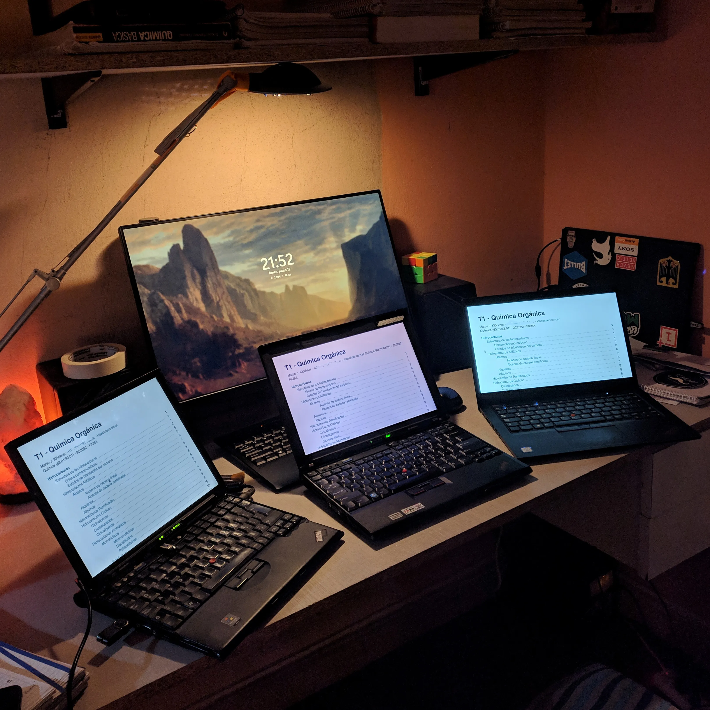

%%
title: "Spending money on thinkpads"
date: "14-Oct-2023"
%%

# Spending money on thinkpads

This is both a happy and a sad post.

For the last couple of years my country's currency has been facing a big
devaluation, in fact is one of the countries with the most inflation rate per
year in the world at the moment, I'm talking about Argentina.

Also I bought my first thinkpad back in October 2022, a thinkpad x200 for $27
which had no charger, and the seller didn't knew if it worked, I bought a
charger for it, then did a full cleanup, installed an SSD, and it has been
working perfectly since then. (I posted an
[article](https://kloeckner.com.ar/blog/bought-a-thinkpad/bought-a-thinkpad.html)
on my blog back then)

As you can see in the picture the story doesn't ends there, in fact I bought
more thinkpad products after that, since I was impressed by the build quality of
the x200, and also because I noticed that there is an active market for them.

A while ago I started to ask myself why do I spend money on thinkpads, the main
reason of course is that this computers are so nice to tinker with, as an
Electronics Engineer student I enjoy disassembling this machines to take a look
at the design, and also to restore them into functionality, another reason and
related to the country situation, is that I buy thinkpads because I don't want
the money I had in my pockets to lose value, and I think this is a good
justification, I love thinkpads but I also don't want my money to **devaluate**,
and this is one of the main things the current government want you to do, spend
money, this is what they achieve with printing money like crazy, they destroy
the people saving capabilities, forcing them to spend money in things to prevent
their money to devaluate.

If we take for example the x200 that I bought first, I paid $8000 Argentine
Pesos for it, which was around US $27 back then, today the $8000 would be
equivalent to US $8, and it only passed a year.

Of course this story has a happy side too, always has; during the last 12 months
that I been a thinkpad owner I met people that also where into thinkpads, also
people asking me or amazed by the modular design of the thinkpads, and people
who listened to me when I explained to them why thinkpads are better that other
computers haha.
